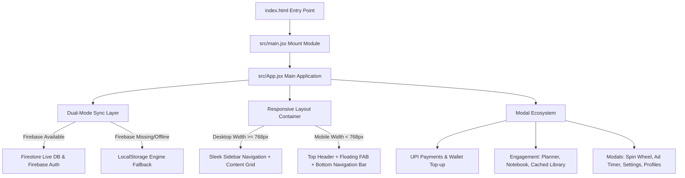

# STUDCRACK🎓

Studcrack is a modern, responsive, and gamified study platform designed for board and entrance exam aspirants (e.g. GATE, WBJEE, JEE Mains, NEET). It helps students share study materials, earn rewards (Emeralds - EMD), manage their preparation schedule, and unlock premium notes and courses.
---
## 🌟 Key Features
- **Responsive Viewport Design**: A fully unified adaptive layout. It presents a sleek navigation Sidebar on desktop viewports and an elegant bottom navigation bar on mobile viewports.
- **Dual-Mode Sync Layer**: Works out-of-the-box locally using `LocalStorage` when Firebase is not configured, while automatically syncing in real-time with Firestore & Firebase Auth when the production configurations are present.
- **Interactive Quizzes**: Curated study quizzes. Answering questions perfectly grants Emeralds (EMD) and updates user notifications.
- **Formula Notebook**: A private formula sheets tracker where students can store study notes, cheat formulas, and definitions by categories.
- **Study Planner**: A target scheduler with custom category tags and date fields. Displays completion progress bars dynamically.
- **Offline Library Cache**: Cache public notes for offline reading. Cached materials are stored locally and accessible at any time.
- **EMD Wallet & UPI Payments**:
  - **Premium Unlock**: Unlock premium study materials or courses using UPI payments (dynamic QR codes and UTR verification) or EMD credits.
  - **Deposit Top-up**: Buy additional EMD credits via simulated secure UPI transfers.
  - **Redeem UPI**: Deduct EMD from the wallet to withdraw INR directly to a UPI address. Includes a transaction ledger log.
- **Daily Login Streak**: Tracks consecutive daily logins, increments streaks, and credits EMD bonuses.
- **Refer & Earn**: Unique referral codes for students to claim EMD bonuses when inviting friends.
- **Inbox Notifications**: Local and cloud notifications for login streaks, quiz completions, and payment confirmations.
---
## 🛠️ Tech Stack
- **Frontend Core**: React 18, HTML5, Vanilla JavaScript
- **Styling**: Tailwind CSS 3 (configured with custom typography & glassmorphism components)
- **Bundler**: Vite 5
- **Backend Database (Optional)**: Firebase Firestore & Authentication
---
## 🏗️ System Architecture
The following diagram maps the structural flow of the Studcrack platform:

### Core Architecture Highlights
1. **Dual-Mode Persistence Wrapper**: Intercepts read/write triggers and diverts state sync either to Firestore collections (`users`, `notes`, `profiles`) or local state coupled with `localStorage`.
2. **Responsive Screen Modes**: Built mobile-first. When screen widths match `md` (768px) and higher, the page automatically attaches a fixed navigation column and switches grids to multiple columns.
3. **UPI Payment Gateway Emulator**: Dynamic scanning payloads are processed client-side through QR codes. Entering a 12-digit transaction ID processes verification logic and records transactions in the Ledger.
---
## 🚀 Getting Started
### Prerequisites
Make sure you have **Node.js** (v18 or higher) and **npm** installed on your system.
### Installation
1. Clone or extract the repository folder.
2. Open your terminal in the project directory and run:
   ```bash
   npm install
   ```
### Running Locally
To launch the development server and view the project in your browser, run:
   ```bash
   npm run dev
   ```
### Building for Production
To compile and optimize the assets for live hosting platforms (Netlify, Vercel, Firebase Hosting, etc.):
   ```bash
   npm run build
   ```
---
## 📂 Codebase Overview
### Project Directory Structure
```text
STUDCRACK/
├── index.html                  # Core HTML layout & Font Loader
├── package.json                # Project dependencies & Dev scripts
├── vite.config.js              # Vite React bundler config
├── tailwind.config.js          # Tailwind utility-class mapper
├── postcss.config.js           # PostCSS autoprefixer builder
├── README.md                   # Documentation guide
└── src/
    ├── main.jsx                # React app mount module
    ├── index.css               # Tailwind baseline CSS & scrollbars
    └── App.jsx                 # Dynamic responsive state controller
```
- [index.html](index.html): Entry point HTML document loading Outfit & Inter fonts.
- [vite.config.js](vite.config.js): Bundler configurations.
- [tailwind.config.js](tailwind.config.js): Tailwind content paths.
- [src/main.jsx](src/main.jsx): React client mounting script.
- [src/index.css](src/index.css): Global classes and Tailwind directives.
- [src/App.jsx](src/App.jsx): Primary state controller, layout shell, and component views.
---
### 🤝 Contributing
We welcome contributions!

- Fork the project.
- Create your feature branch (git checkout -b feature/amazing-feature).
- Commit your changes (git commit -m 'Add some amazing feature').
- Push to the branch (git push origin feature/amazing-feature).
- Open a Pull Request.
---

### 📊 Project 
Made with ❤️ for students worldwide ⭐ Star us on GitHub — it motivates us a lot!
© STUDCRACK Tech 2026. All rights reserved.
